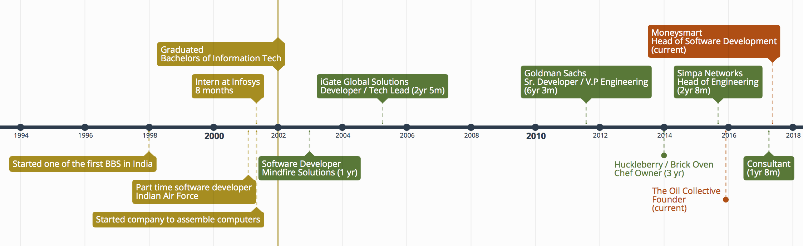

# Siddharth Krish - Engineering enthusiast

I am an entrepreneur, technology enthusiast and an expert in building software products & teams. I have over 15 years of experience in creating products and managing multidisciplinary teams. I am wired to solve problems in highly cross-functional areas.

I have led various teams in both the technology world and outside with my primary focus being on building leaders who can easily take over and replace me. Having or building my own knowledge of the areas I manage has been critical to my ability to succeed in my role.

## What can I offer?
* I'm excellent at identifying the companies requirements and the gaps
* I get along well with almost everyone that I work with
* Having a long and proven track record of creating teams that perform at a very high level
* Lead by example & building consensus is my leadership style
* I'm rooting for the underdog which is another way of saying that my empathy for the people in the team usually translates to a motivated team that has the desire to work hard, have fun but constantly communicate
* I understand the importance of communication upwards, sideways and below.

## Work Experience
Most of the description below is demonstrating my leadership skills, I've been a very active developer in most teams that I've been part of but have decided to leave the tech stack & details out of this. Leave me a note & I'll be happy to chat about technology.

If you don't want to read through this, just have a look at the timeline that I've put together on top to get a summary view of my experience so far.

### Head of Software Development - Moneysmart
---
Responsible for building a software development team in Singapore and setting up an offshore team in Bangalore. My responsibilities included

* Hire & retain top talent
* Identify the requirements of the team
* Help identify gaps and come up with solutions
* Encourage teamwork & motivate the team
* Be the technical leader people can come to when they need support
* Work with the CxO's to plan and execute the team's strategy
* Take an active role in the companies product strategy & planning
### Head of Engineering - Simpa Networks
---
Build the software team & architect the best possible software solutions to help the company achieve it's business goals. I was responsible for
* Build the software development team
* Hire outsourced development partners
* Interface with the various business teams & drive the companies platform projects
* Plan & execute various software projects
* Work with our manufacturing partner to create a cheap & reliable way to write the boards firmware. Hint: raspberry pi :)
### Technology Consultant - Independent
---
Helping clients perform various technical tasks & successfully run a project from start to finish. By following agile & kanban I successfully managed to give clear visibility of my work & build successful products. In this time I worked with Simpa Networks & iSafe Mobile
* Plan the projects from start to finish
* Come up with ways to communicate my progress with the clients (used trello & Kanban)
* Write code

### VP Engineering - Goldman Sachs
---
Heading the Bangalore team responsible for the companies SOA strategy and infrastructure.
* Technical lead for the Bangalore arm of the SOA team
* Project management & evangelize the platform we were creating
* Highly involved in the technology teams hiring
* Introduce and set best practices like CI/CD, automated tests etc. for various teams
* Played an active role in a couple of diversity groups (Women in India & the LGBT network) 
### Technical Lead - iGate Global Solutions
---
At iGate I was responsible for products we wrote for leading mobile manufacturer. The technologies involved were Java, J2ME & MAPI to connect to the Exchange servers.

### Software Developer - Mindfire Solutions
---
Created a product that was a Caching & Filtering Proxy server for Mac OS X & 9.

### Developer Intern - Infosys
---
Was part of a black ops development team inside Infosys that was responsible for working on highly technical projects.

* Created an NDIS driver (C++) to compress data streams in real-time.
* Worked on a product to help figure out the condition of railway tracks

## Non-Technical Experience
### Chef Owner - Huckleberry
---
Founder of Huckleberry, a thin crust wood fired pizza place in Bangalore, the first of its kind. Had a successful exit.

### Founder - The Oil Collective
---
Founded a company that sources, manufactures cold pressed & essential oils locally around Bangalore and markets them through retail & online channels.

## Pre-Graduation Experience
### Software Developer - Indian Air Force
---
Wrote and maintained the inventory management system for the Air Force canteen.

### Founder - Assembling computers
---
Started a company that assembled computers from components just as computers were starting to come into peoples homes.

### Founder - Bulletin Board Service
---
Started a BBS in Delhi as an accident. Was just a kid who wanted to be on "the internet".

## Technical Stacks
* **Front End:** Bootstrap, jquery, Semantic UI, slim
* **Programming Languages**: Java, Javascript, Ruby, Golang, C#, C++
* **Databases**: MySQL, SQLite, Postgres
* **Frameworks & Tools**: Kafka, Zookeeper, AWS (EC2, Lambda, S3 etc.)
* **Contributions**: Java 8, Zookeeper